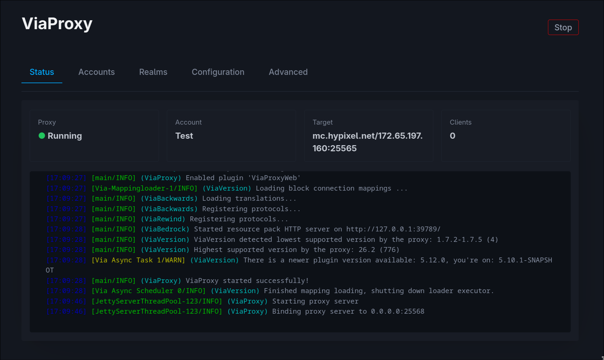

# ViaProxyWeb

A web interface and API for [ViaProxy](https://github.com/RaphiMC/ViaProxy).



## Features

- Live logs from ViaProxy
- Microsoft and Bedrock account login
- Account management
- ViaProxy configuration management
- Realms browsing and joining

## Security
**ViaProxyWeb currently does not provide its own authentication or authorization layer**

Do not expose the web interface directly to the internet.

## Requirements

- Java 25
- [ViaProxy](https://github.com/RaphiMC/ViaProxy) 3.4.0 or newer

## Installation
Download the latest version from the [releases](https://github.com/Lz4Lz/ViaProxyWeb/releases) page and place the JAR file in ViaProxy's ```plugins``` directory.

## Configuration

By default, the web server listens on:
```yaml
address: 127.0.0.1
port: 8080
```
These can be changed in ```plugins/ViaProxyWeb/config.yml```

## Issues

Found a problem or have a feature request? Open an [issue](https://github.com/Lz4Lz/ViaProxyWeb/issues).
